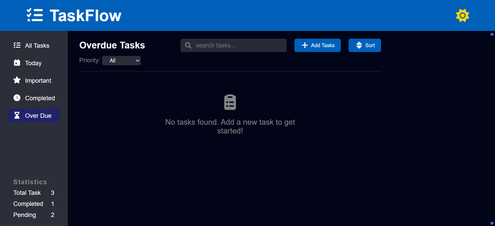
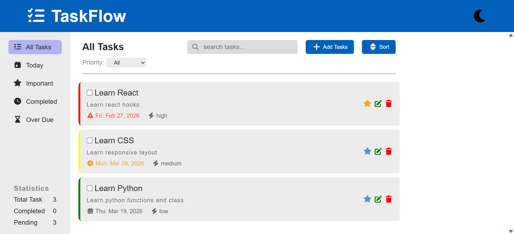
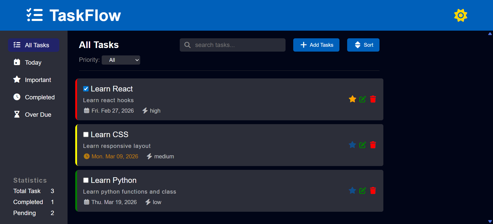
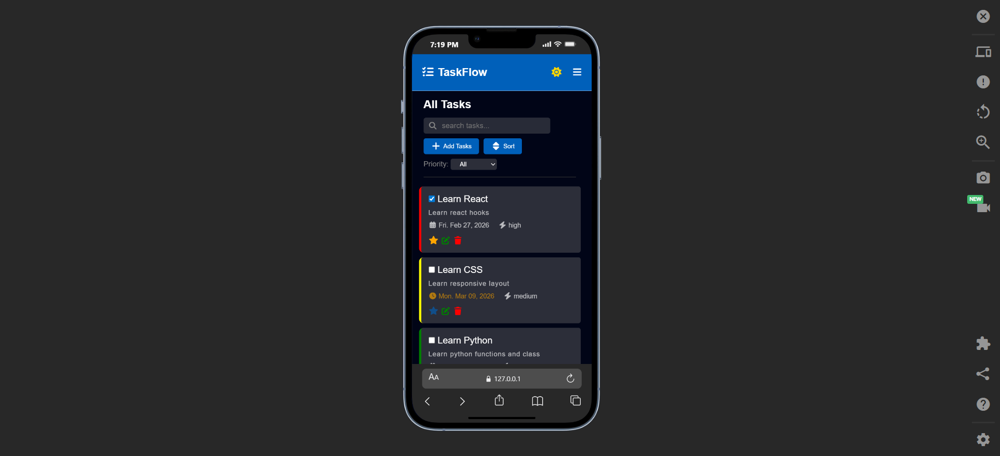

# TaskFlow

TaskFlow is a modern and responsive **task management web application** that helps users organize, prioritize, and track their daily tasks efficiently.

Built with **HTML, CSS, and JavaScript**, TaskFlow provides an intuitive interface for managing tasks with features like filtering, sorting, priority labeling, and dark/light theme support.

---

## Features

- Add, edit, and delete tasks
- Mark tasks as important
- Mark tasks as completed
- Track **today's tasks** and **overdue tasks**
- Search tasks by title
- Filter tasks by **priority**
- View task **statistics** (total, completed, pending)
- Sort tasks by:

- Priority
- Due date
- Alphabetically
- Toggle between **Dark Mode and Light Mode**
- Tasks are saved using **LocalStorage**
- Fully **responsive design** for mobile and desktop

---

## Technologies Used

- **HTML5**
- **CSS3**
- **Vanilla JavaScript**
- **LocalStorage API**
- **Font Awesome Icons**

---

## 📂 Project Structure

```
TaskFlow
│
├── index.html
├── style.css
├── script.js
└── README.md
```

---

## How to Run the Project

1. Clone the repository

```
git clone https://github.com/kalabGoitom/TaskFlow.git
```

2. Open the project folder

```
cd taskflow
```

3. Open `index.html` in your browser.

---

## Live Demo

You can view the live version here:

```
(Add your Vercel link here after deployment)
```

---

## Screenshots

### Dashboard



### light Mode



### Dark Mode



### Mobile View



---

## Future Improvements

- Task categories or tags
- Backend database integration
- User authentication
- Notifications for upcoming tasks

---

## Author

Developed by **Kalab Goitom**

---

## Support

If you like this project, feel free to **star the repository** and share feedback!
